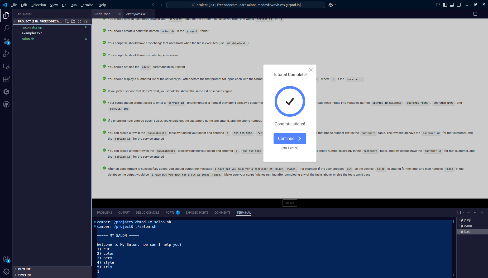
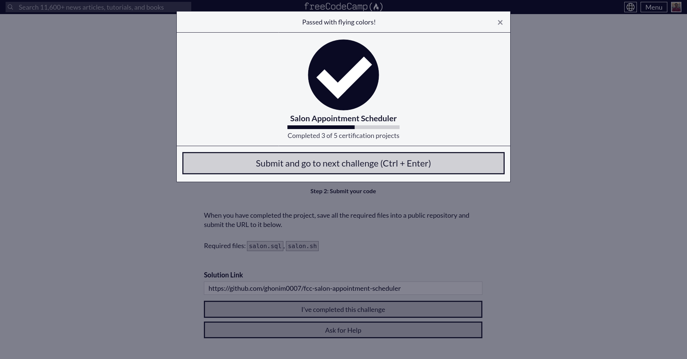

# **Salon Appointment Scheduler**  

This project is a **Bash script** that interacts with a **PostgreSQL database** to manage salon appointments. It allows customers to book services, store their information, and retrieve appointment details.  

---

## **How to Use**  

1. **Create the database** and restore its structure by running:  
   ```sh
   psql --username=freecodecamp --dbname=postgres -f salon.sql
   ```  
2. **Make the script executable** (if not already):  
   ```sh
   chmod +x salon.sh
   ```  
3. **Run the appointment scheduling script**:  
   ```sh
   ./salon.sh
   ```  

---

## **Completion Proof**  

Below are the images confirming the successful completion of this project:  

  
  

---

This project was completed as part of the **freeCodeCamp Relational Database Certification**. 🚀  
